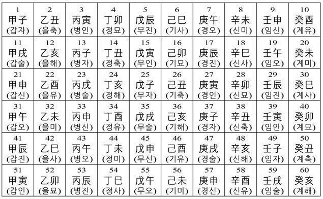
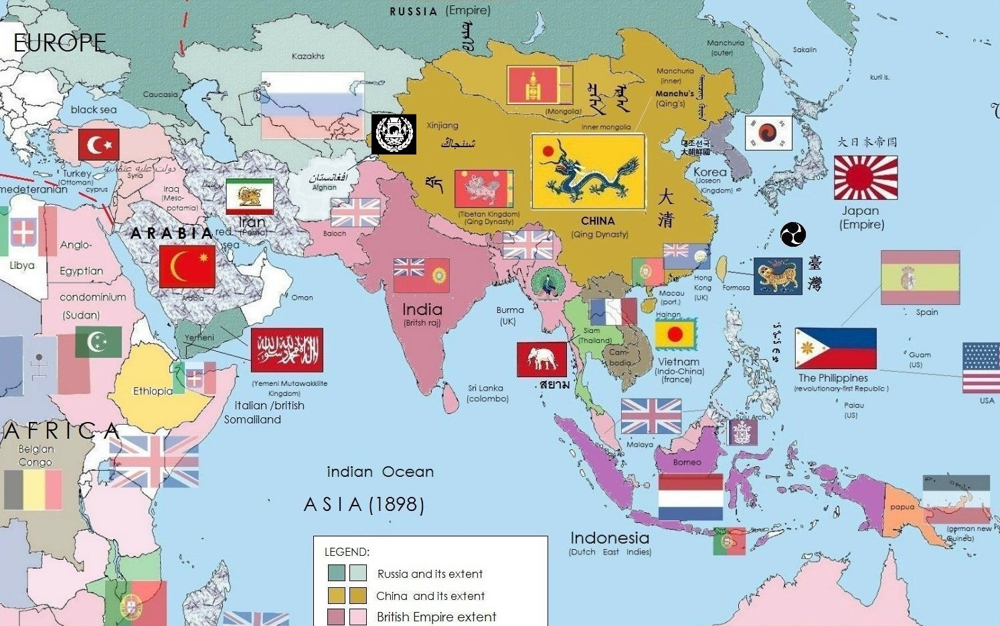

# 조선에 온 파란 눈의 순교 성인들

## 프란치스코반

### 2024년 09월 06일

---

## 한국 순교자들에게 바치는 기도

○ 이 땅의 모든 순교자여,
당신들은 하느님의 은총에 힘입어
굳은 신앙으로
예수 그리스도의 사랑과 복음과 교회를 위하여
피를 흘리셨나이다.

● 저희는 현세에서 악의 세력과 치열하게 싸우며
당신들이 거두신 승리의 영광을 노래하고
모든 선의 근원이신 하느님을 찬양하오니
저희를 위하여 빌어 주소서.

---

○ 위대하신 순교자들이여,
천상의 모후이신 성모 마리아와 함께
저희를 위하여 빌어 주시어
하느님의 자비를 얻어 주소서.

● 지금도 어둠의 세력이
교회를 박해하고 있사오니
하느님께서 전능하신 팔로
교회를 붙들어 보호하시며
아직 어둠 속에 있는 지역에까지
널리 펴시도록 빌어 주소서.

---

○ 용감하신 순교자들이여,
특별히 청하오니
우리나라를 위하여 하느님께 빌어 주소서.

● 당신들은 이 땅에서 많은 고난을 겪으며 사시다가
목숨까지 바치셨사오니

○ 전능하신 하느님께 빌어 주시어
교회를 이 땅에서 날로 자라게 하시며
사제를 많이 나게 하시고

---

● 신자들이 주님의 계명을 잘 지키고
냉담자들은 다시 열심해지며
갈린 형제들은 같은 믿음으로 하나 되고
비신자들은 참신앙으로 하느님을 알아
천지의 창조주
인류의 구세주를 찾아오게 하소서.

○ 참으로 영광스러운 순교자들이여,
저희도 그 영광을 생각하며 기뻐하나이다.
간절히 청하오니
자비로우신 하느님 아버지께 빌어 주시어
저희와 친척과 은인들에게
필요한 은혜를 얻어 주소서.

---

● 또한 저희가 죽을 때까지
예수 그리스도를 한결같이 믿어 증언하며
비록 피는 흘리지 못할지라도
주님의 은총을 입어 선종하게 하소서.

○ 성 김대건 안드레아와 성 정하상 바오로와
동료 순교자들이여,

● 저희를 위하여 빌어 주소서. 

[출처] 순교자성월기도문 한국순교자들에게 바치는 기도문|작성자 임동훈
<!-- https://missa.cbck.or.kr/DailyMissaInfo/350 -->

---

## 9월은 순교자 성월 (Holy month of Martyrs)

* 한국 교회는 해마다 9월을 '[순교자 성월](https://missa.cbck.or.kr/DailyMissaInfo/MM009)'로 지냄
* 1846년 9월 16일 김대건 안드레아 순교
  * 새남터 (현재 용산구 이촌동) 형장에서 참수
* 크게 알려진 천주교 박해 (Catholic Persecution)
  * 신해 박해 (1791년) - 오가작통법 탄생
  * 기해 박해 (1839년) - 앵베르 주교, 샤스탕, 모방, 정하상 (정약용의 조카) ...
  * 병오 박해 (1846년) - 김대건 신부 순교
  * 병인 박해 (1866년) - 흥선 대원군 시절, 역사상 최대 규모

---

## 조선 천주교와 박해의 역사

* 18세기 시작 (1784년 최초의 세례 교인 이승훈의 신앙 모임)
* 정약용, 정약전 형제, 이승훈의 천주학 연구
* 신해박해 (1791년), 을묘박해 (1795년), 정사박해 (1797년)
* 신유박해 (1801년), 을해박해 (1815년), 정해박해 (1827년), 기해박해 (1839년), 병오박해 (1846년), 경신박해 (1860년),병인박해 (1866년)
* 한티 천주교 박해 (1868년)

<!-- https://ko.wikipedia.org/wiki/%EC%A1%B0%EC%84%A0%EC%9D%98_%EC%B2%9C%EC%A3%BC%EA%B5%90_%EB%B0%95%ED%95%B4 -->

---

## 여기서 잠깐 상식 - 60갑자 (六十甲子)

* [Sexagenary cycle](https://en.wikipedia.org/wiki/Sexagenary_cycle), 십간(十干)과 십이지(二支)를 조합한 연도 셈법
* 2024년은 갑진년(甲辰年) = (2024%10=4 甲) + (2024%12=8 辰)

| Mod | 0 | 1 | 2 | 3 | 4 | 5 | 6 | 7 | 8 | 9 | 10 | 11 |
|-|-|-|-|-|-|-|-|-|-|-|-|-|
| 십간 | 경(庚) | 신(辛) | 임(壬) | 계(癸) | 갑(甲) | 을(乙) | 병(丙) | 정(丁) | 무(戊) | 기(己) |
| 십이지 | 신(申) | 유(酉) | 술(戌) | 해(亥) | 자(子) | 축(丑) | 인(寅) | 묘(卯) | 진(辰) | 사(巳) | 오(午) | 미(未) |
| 띠 | 🐵 | 🐔 | 🐶 | 🐷 | 🐭 | 🐮 | 🐯 | 🐰 | 🐲 | 🐍 | 🐴 | 🐏 |
---

10과 12의 최대공약수 (GCD) = 2
10과 12의 최소공배수 (LCM) = 60

육갑 (六十甲子) Table

---

## 피에르 모방 (Pierre Maubant)

* 1803년 12월 31일, 프랑스 바시 (Vassy) 출생
* 1829년 사제 서품, 1831년 파린외방전교회 입회
* 1835년 조선에 밀 입국
* 1839년 기해년 박해 때 순교
* 1984년 교황 요한바오로2세에 의해 한국 103위 순교 성인으로 시성

---

## 프랑스 파리 외방 전교회

* [Missions étrangères de Paris](https://missionsetrangeres.com/)
* 외방 전교 (Foriegn Mission) - 해외 선교
* 1658년 교황청 직속으로 설립
* 주로 아시아 국가를 대상으로 전교 활동을 해온 역사적인 단체
* 1831년 북경 교구에서 조선 대목구가 분리,지정 되며 바르텔르미 브뤼기에르 주교 배출
* 1942년 10대 노기남 바오로 주교가 임명되며 사목활동의 책무를 점차 한국인에게 인계
* 현재도 14개국 150명의 사제가 전교 활동 중

---

## 조선 대목구 주교 계보

* 1대  - 바르텔르미 브뤼기에르 (Barthélemy Bruguiére)
  * 역설적이게도 조선에 끝내 입국 하지 못함
  * 1832년에 조선 사목구 주교 임명 후 마카오에서 중국(청)으로 출발
  * 1835년에서야 열하성 도착 (만주), 뇌출혈로 선종, 모방 신부가 시신 수습
  * 1897년 마티뇽 박사에 의해 무덤 발견, 1931년에 용산 성당 묘역으로 이장
* 2대 - 로랑조제프마리위스 앵베르 (Laurent-Joseph-Marius Imbert)
  * 1837년 압록강을 건너 입국
  * 1839년 기해 박해로 샤스탕 야고보 신부 (Jacques Chastan)와 함께 순교
  * 한국 103위 순교 성인

---

## 조선 대목구 주교 계보 (Cont..)

* 3대 - 장 페레올 (Jean-Joseph-Jean-Baptiste Ferréol)
  * 1845년 김대건, 다블뤼 신부와 함께 배로 밀입국 (상해-충청남도 황산포)
  * 1853년 45세 나이로 과로사
* 4대 - 시메옹프랑수아 베르뇌 (Siméon-François Berneux)
  * 1854년 만주 교구 보좌 주교에서 조선 대목구 주교로 임명, 1855년 입국
  * 1866년 브르트니에르, 도리, 볼리외 신부와 함께 효수형 순교 (한국 103위)
* 5대 - 다블뤼 안토니오 (Marie-Nicolas-Antoine Daveluy)
  * 1866년 병인 박해로 충남 보령 갈매못에서 순교 (한국 103위 순교 성인)
* 1911년 대구대목구 분리 (드망즈 주교), 1950년 서울 대목구로 명칭 변경

---

## TBD 조선에 온 신부님들의 주요 업무

* 세례
* 공소 방문
* ...

---

## TBD 여기서 잠깐 상식 - 우리는 어디 소속?

남아라비아 대목구

---

## TBD 모방 신부의 편지

http://anthony.sogang.ac.kr/Dallet/LettersMartyrs.html

---

## TBD 순교 성인들의 밀입국 경로

---

## TBD 여기서 잠깐 - 조선 중기의 외국인들

박연, 하멜
임진왜란 흑인 용병

---

## TBD 19세기 (19century) 세계 지도

<!-- https://ko.wikipedia.org/wiki/%EC%95%84%EC%8B%9C%EC%95%84%EC%9D%98_%EC%97%AD%EC%82%AC -->

---

## TBD 음역(번역)되어 들어온 나라 이름, 단어

<!-- https://namu.wiki/w/%EC%9D%8C%EC%97%AD(%EB%B2%88%EC%97%AD) -->

* 미국, 영국, 태국, 남아공, 소련
* 독일, 이태리, 불란서, 서반아, 포도아, 아라사, 인도, 인니
* 희랍, 유대, 나전, 구라파, 아세아, 호주
* 거란, 돌궐, 여진
* 가배, 아편, 담배
* 가부좌, 미륵, 보살, 비구니, 사리, 석가모니, 아미타불
* 석호필, 안나, 요섭, 야훼/여호와
* 일본식 음역 - 구락부, 구두, 가방

---

## TBD 난징 조약 (남경, Treaty of Nanking)

* 1차 아편전쟁에서 패배한 청나라가 영국과 맺은 불평등 조약
* 홍콩의 탄생

---

## 육분의

---

## TBD 장바티스트 세실 (Jean-Baptiste Thomas Médée Cécille)

https://ko.wikipedia.org/wiki/%EC%9E%A5%EB%B0%94%ED%8B%B0%EC%8A%A4%ED%8A%B8_%EC%84%B8%EC%8B%A4
프랑스의 해군 함장, 정치인
김대건을 통역관으로 대리고 남경조약 참관
사형선고를 받은 조선 대목구 4대 주교 베르뇌 주교를 구조
김대건 구출 시도 그러나 처형을 촉진하게되는 결과

---

## 마침 기도: 영광송

(밑줄 부분에서 고개를 숙이며)

<u>영광이 성부와 성자와 성령께</u>

처음과 같이

이제와 항상 영원히.

아멘.