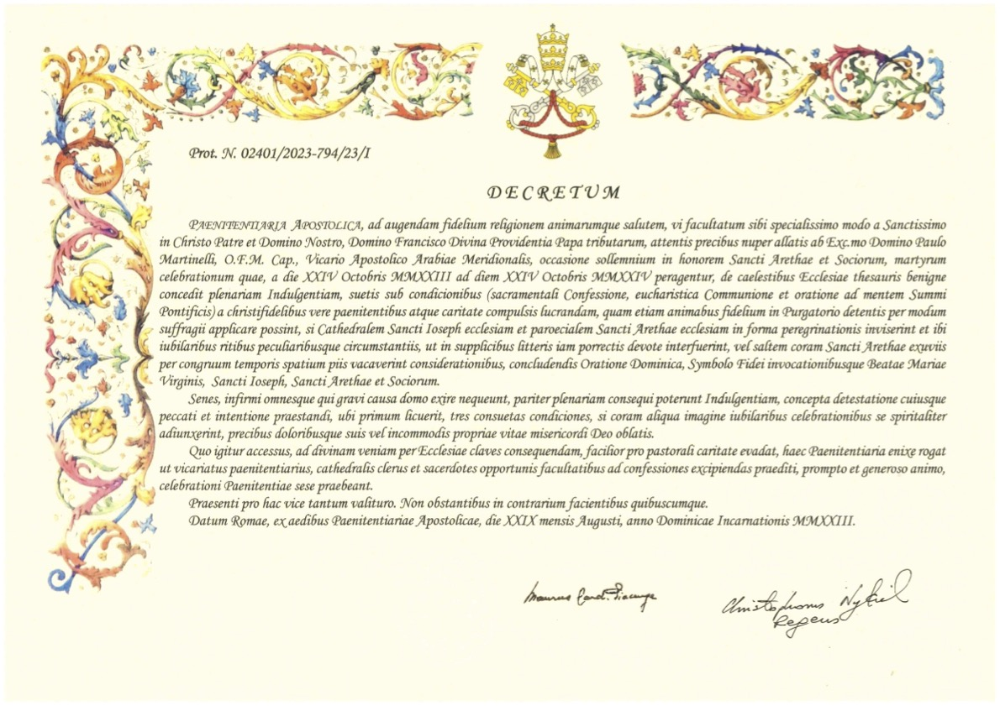

# 전대사와 홀리도어

## 2024년 03월 16일


### 아부다비성당 주일학교 프란치스코반

<!--

출처:
https://m.catholictimes.org/mobile/article_view.php?aid=162781

-->

---

## 시작 기도: 사도 신경

전능하신 천주 성부

천지의 창조주를 저는 믿나이다.

그 외아들 우리 주 예수 그리스도님

(밑줄 부분에서 모두 깊은 절을 한다.)
<u>성령으로 인하여 동정 마리아께 잉태되어 나시고</u>

본시오 빌라도 통치 아래서 고난을 받으시고

십자가에 못 박혀 돌아가시고 묻히셨으며

---

저승에 가시어 사흗날에 죽은 이들 가운데서 부활하시고

하늘에 올라 전능하신 천주 성부 오른편에 앉으시며

그리로부터 산 이와 죽은 이를 심판하러 오시리라 믿나이다.

성령을 믿으며

거룩하고 보편된 교회와 모든 성인의 통공을 믿으며

죄의 용서와 육신의 부활을 믿으며

영원한 삶을 믿나이다.

아멘.

---

## 전대사란? 

Plenary Indulgence

대사(大赦)의 일종. 전대사는 대사 중에서도 죄에 따른 잠벌(暫罰)에서 전부 풀리는 ‘전면대사’를 말한다.

가톨릭교리서는 죄과에 대한 벌을 모두 면제받는 것을 전대사, 부분적으로 면제받는 것을 부분대사 또는 한대사라고 가르친다

(가톨릭교회교리서 1471항).

---

## 초대 교회로 거슬러 올라가는 전대사의 유래

초대교회 사도들은 신자가 죄를 지으면 공동체에서 쫓아 내기까지 했다고 함.

죄인이 속죄하면 하느님으로부터 용서를 받고 공동체에 다시 참여할 수 있었음

사도들 또한 교회 공동체가 죄인의 속죄를 위해 함께 용서를 간구할 것을 권유

이후 속죄자(죄를 짓고 회개하는 자)는 교회가 정한 엄격한 보속을 실천하였고, 교회는 그들을 위해 함께 기도하고, 함께 용서를 구함

---

## 연옥 신앙과 잠벌

하지만 보속을 이행하지 못하거나 미처 다 하지 못한 경우?
또는 미처 고해 하지 않은 죄가 있다면?

* 연옥에서 잠벌을 마저 갚아야 함

```
연옥 燃獄 - 태우는 감옥, Purgatorium (정화)
성경에는 나오지 않으나 연옥의 존재를 뒷받침 하는 구절이 많음
피렌체공의회(1438~1445), 트리엔트공의회(1545~1563)에서 교리로 확정
```

---

## 구원을 비는 기도

예수님, 저희 죄를 용서하시며

저희를 지옥 불에서 구하시고

연옥 영혼을 돌보시며

가장 버림받은 영혼을 돌보소서.

<!--
Q. 연옥에 관한 교리는 성경에 나와 있나요?

A. 성경에 연옥이라는 말이 나오진 않습니다. 그러나 교회는 연옥 교리를 특히 피렌체공의회(1438~1445)와 트리엔트공의회(1545~1563)에서 확정했는데, 성경 구절들로 연옥의 존재를 알 수 있기 때문입니다. 성경에는 ‘그들이 죄에서 벗어나게 하려는 것이었다’(2마카 12,45)라는 죽은 이들을 위한 속죄에 관한 구절이 있는데, 이와 관련해 네덜란드 로테르담교구 미헬 레메리 신부는 책 「하느님과 트윗을」에서 “이들이 만약 지옥에 있다면 기도는 그들에게 도움이 될 수 없었을 것이고, 천국에 있다면 기도는 필요 없었을 것”이라며 “틀림없이 연옥이 존재한다”고 강조합니다. 특히 미헬 레메리 신부는 “이는 신약 성경에서 더 분명해진다”며 바오로 사도와 베드로 사도는 영혼 구원과 관련해 ‘불 속’(1코린 3,15), ‘불로 받는 단련’(1베드 1,7)을 말했고, 예수님께서는 ‘성령을 거슬러 말하는 자는 현세에서도 내세에서도 용서받지 못할 것’(마태 12,32)이라고 하셨다며 “예수님 말씀에서 어떤 죄는 사후 즉 우리가 연옥이라고 하는 상태에서 용서받을 수 있다고 이해할 수 있다”고 말합니다.
-->

---

## 잠벌의 공포와 고해의 중요성

연옥의 영혼들은 보속이나 전대사의 찬스가 더 이상 주어지지 않음

평소에 고해 하는 습관과 보속을 철저히 지키는 자세가 필요

우리가 고해하지 않은 소죄들의 관리도 중요
  => '이 밖에 알아내지 못한 죄도 용서하여 주십시오...'

---

## 사도신경과 통공 교리

하지만 우리에겐 사도신경이 있음!

```
사도신경에 언급된 통공 교리 - '모든 성인의 통공을 믿으며'
  * 통공 通功 Communio Sanctorum
  * 공(功)이 서로 통(通)한다는 뜻이다. 즉 공로와 선행이 서로 통한다는 의미
  * 개신교에서는 '성도가 서로 교통하는 것'으로 표현
  * 산자와 죽은자가 모두 서로를 위해서 기도해 주는 것이 '모든 성인의 통공'
```

<!--
전대사의 비밀
https://www.youtube.com/watch?v=RrtQnAwVAcE
-->

---

## 죽은이에게도 양도 가능한 전대사

연옥에서 고통 받는 영혼들을 위해 교회는 살아 있는 신자들이 대신 보속할 수 있다고 믿음

* 우리는 주님 아래 모인 공동체

전대사는 나의 잠벌도 용서 받을 수 있지만, 전대사가 불가능 한 연옥 영혼에게 양도 가능한 우리에게는 빛과 같은 찬스

```
주의 - 살아있는 사람에게는 양도 불가
산 자들은 신앙 고백, 죄에 대한 고해성사 및 보속 필요!
```

<!--
---

## 참고: 죄에 따른 보속의 난이도

* 보통은 주님의 기도나 성모송 바치는 과제 부여
* 일부 신부님들은 묵주기도 5단이 기본인 경우도 있다고 함
* 욕한 사람 7일간 금식, 성사 중 떠든 사람 10일간 금식 등의 사례도...
* 일반 사제가 보속을 주기에 너무도 무거운 죄의 고회는 교황이나 교황에게 특별 권한을 받은 고위 성직자만 가능한 경우도 있다고 함
  * 성체 모독, 낙태, 살인 ... 등의 경우 '파문'까지 가능
  * 70년대 안중근 복권 -> 안의사께서 가톨릭에서 공식 파면된 적은 없으나 93년 김수환 추기경 께서 정당방위로 정리

=> 신부님 수정 요청
일제 수탈의 원흉인 이토 히로부미를 저격 암살, 일제치하의 제도교회에 의해 단죄됐던 안중근(토마) 의사가 84년만에 김수환 추기경의 공개 사과로 의거의 정당성을 인정받았다. 1993년 8월 29일

2016년 자비의 특별 희년
“낙태는 엄중한 죄이지만, 진정으로 회개하는 마음에 하느님의 자비가 다다르지 않는 죄는 없다”며 희년 기간에 고해 사제들에게 부여한 낙태죄에 관한 사죄 권한도 연장한다고 밝혔다.
http://www.cpbc.co.kr/CMS/newspaper/view_body.php?cid=661387&path=201611
-->

---

## 중세 때 ‘대사부’ 역시 전대사?

중세 때 교회에서 일부 전대사가 오용된 일이 있었음

* 베드로대성당을 짓기 위한 대사부 (indulgence) 를 판매
* ‘면죄부’라는 알려진 표현은, ‘전대사’의 잘못된 번역
* 16세기 종교 개혁 촉발, 개신교 탄생
* 대사는 벌을 면해주는 것일 뿐 죄를 용서 받는 길은 고해성사 뿐

<!--
https://ko.wikipedia.org/wiki/%EB%8C%80%EC%82%AC_(%EA%B0%80%ED%86%A8%EB%A6%AD)
-->

---

## 전대사가 주어지는 방법

교황님이 25년 주기의 정기 성년 또는 희년 (禧年, Jubeeli)마다 전대사 부여

```
희년은 유대교의 안식일/안식년 전통에서 유래
7번째 안식년 (7x7) = 49년, 그 다음해인 50년째인 해가 희년

1470년 부터 교황청의 정기 희년은 25년으로 정해짐
```

또는 교황청의 비 정기 희년 선포 시

* 2021년 성 김대건 신부님 탄생 200주년 희년 선포, 전대사 부여

---

## 아라비아 순교자 탄생 1500주년 기념 희년 선포

* [2023년 11월 9일 바티칸 뉴스](https://www.vaticannews.va/en/church/news/2023-11/abu-dhabi-holy-door-opened-jubilee-of-arabian-martyrs-emirates.html)
* AD 523년 현재 사우디의 고대 도시 나즈란 출신의 성 아레타스 (St. Arethas) 와 그의 동료들이 고대 예맨 히미야르 왕국과 에티오피아의 악숨사이의 갈등에서 순교를 맞게 되는 사건 발생
* 1500년 뒤 2023년을 아라비아 순교자의 희년 (Jubilee of Arabian Martyrs) 으로 선포하고 Holy Door 전격 개방 및 전대사 부여

---

## 전대사 시행령 (Indulgence Decree)



<!--
https://stjosephsabudhabi.org/holyyear-indulgence
-->
---

## 아라비아 순교자 1500주년 전대사의 조건

* 기간 2023년 10월 24일 ~ 2024년 10월 23일 동안 매일 주어짐
* 고해성사 (1회 30일간 유효)
* 성 요셉 성전의 Holydoor를 순례
* 영성체
* 교황님의 지향을 위해 기도를 실행
  * 주님의 기도, 성모송,  영광송
* 전대사 조건 충족 후 "저는 이 전대사를 나를 위해 또는 돌아가신 누구를 위해 바칩니다" 라고 속으로 기도

---

## 주님의 기도

◎ 하늘에 계신 우리 아버지, 아버지의 이름이 거룩히 빛나시며

아버지의 나라가 오시며 아버지의 뜻이 하늘에서와 같이 땅에서도 이루어지소서

오늘 저희에게 일용할 양식을 주시고 저희에게 잘못한 이를 저희가 용서하오니

저희 죄를 용서하시고 저희를 유혹에 빠지지 않게 하시고

악에서 구하소서.

아멘

---

## 성모송

○ 은총이 가득하신 마리아님, 기뻐하소서!
주님께서 함께 계시니 여인 중에 복되시며
태중의 아들 예수님 또한 복되시나이다.

● 천주의 성모 마리아님,
이제와 저희 죽을 때에
저희 죄인을 위하여 빌어주소서.
◎ 아멘.

---

## 마침 기도: 영광송

(밑줄 부분에서 고개를 숙이며)

<u>영광이 성부와 성자와 성령께</u>

처음과 같이

이제와 항상 영원히.

아멘.